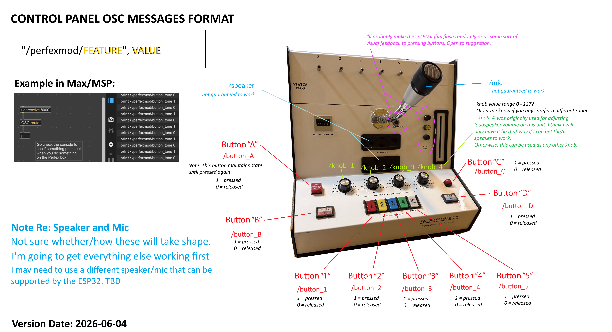
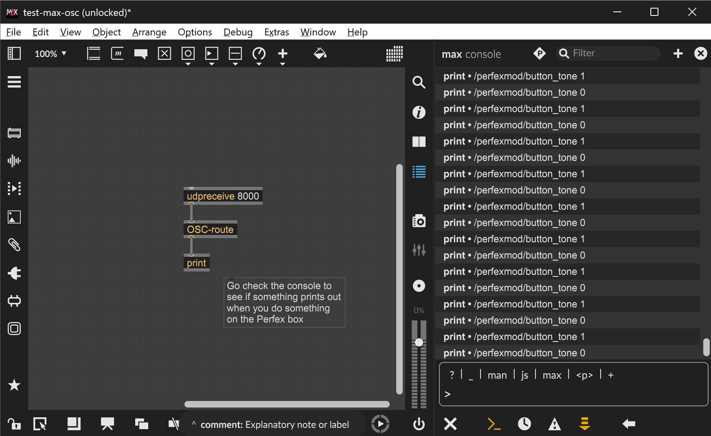

# control-panel-perfex-mod
A modified Perfex emergency service performance testing unit.

Built with Arduino using an ESP32-S3.

The main Arduino file is `control-panel-perfex-mod/control_panel_perfex_mod.ino`

## Installations/Dependencies

### Arduino

#### 1. Install the Arduino IDE

Download link: [https://www.arduino.cc/en/software/](https://www.arduino.cc/en/software/)

#### 2. Install support for the ESP32-S3 board (in Arduino IDE)

`Boards Manager` > Install `esp32 by Espressif Systems`

#### 3. Install Library: OSC by CNMAT (in Arduino IDE)

[OSC by CNMAT](https://github.com/CNMAT/OSC) enables OpenSoundControl (OSC) communication. 

You can download the OSC library directly from Github, or find it in this repo under `Libraries > OSC-master.zip`

Then, manually install by opening the .ino file in Arduino IDE,

`Sketch > Include Library > Add .ZIP Library... >` [Select OSC-master.zip from the Libraries folder of this repo]

#### 4. Install Library: ESP8266Audio by Earle F. Philhower, III

In the Library Manager, search for and install the `ESP8266Audio` library by `Earle F. Philhower, III`

#### 5. Install Library: Adafruit NeoPixel by Adafruit

In the Library Manager, search for and install the `Adafruit NeoPixel` library by `Adafruit`

## Setting up Wifi connection

1. Navigate to the directory `control_panel_perfex_mod/`

2. Make a copy of the file `private_credentials.h`

3. Rename the duplicated file `private_credentials.local.h`

4. Open `private_credentials.local.h` and replace the placeholder WiFi SSID (name as it appears) and password.

`private_credentials.local.h` is used to store private credentials that won't be uploaded to Github because it is specified in .gitignore.

## SD Card and Audio
- Format the SD card as FAT32
- Audio files: .WAV preferred but .MP3 acceptable. 
- The `Audio` folder contains copies of .WAV files that are loaded onto an SD Card.

## Testing and Integrating

The control panel sends out OSC broadcasts as described below:

### Max/MSP

To use OSC within Max/MSP:

See file `Tests > test-max-osc.maxpat` for an example use case with Max/MSP

Install the CNMAT Externals by CNMAT library if you don't already have it:

1. In the top toolbar in your Max/MSP patch, go to `File > Show Package Manager >` Search for "CNMAT"

2. Select and install `"CNMAT Externals by CNMAT"`

Refer to the example image below for usage of the `OSC-route` object. Once you have the library installed you can right click the object to access further documentation.

### Unity

Official OSC Protocol Support for Unity Editor

[https://github.com/Unity-Technologies/UnityOSCProtocolSupport](https://github.com/Unity-Technologies/UnityOSCProtocolSupport)
